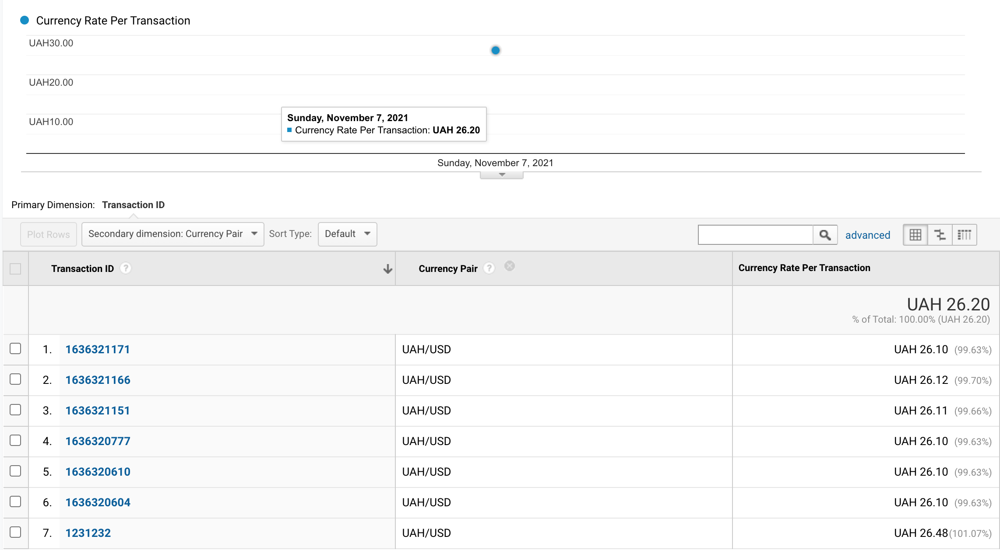

# HSA L3: GAMP Worker

This an example project to show how Google Analytic Measurement Protocol works.

## General
The docker container contains PHP script that is running by cron job every minute.
PHP script requests from NBUStatService the last UAH/USD currency ratio update and sends the data to Google Analytics via Measurement Protocol.

## How to test

### First Time Prerequisites
* Installed docker.
* By default, php script is running by cron every minute. You can change it via `cron` argument in `docker-compose.yml` file.

#### Run the docker GA stack
```bash
docker-compose up -d
```

#### To stop the GA stack run
```bash
docker-compose down
```
##### or next command to remove with volumes
```bash
docker-compose down -v
```

## Sample Test
